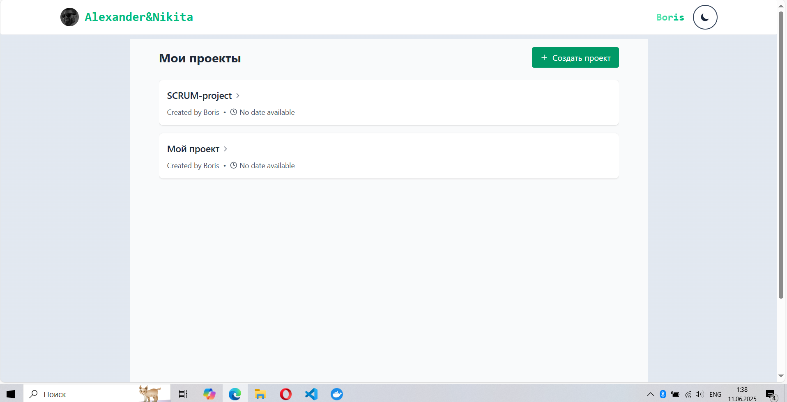
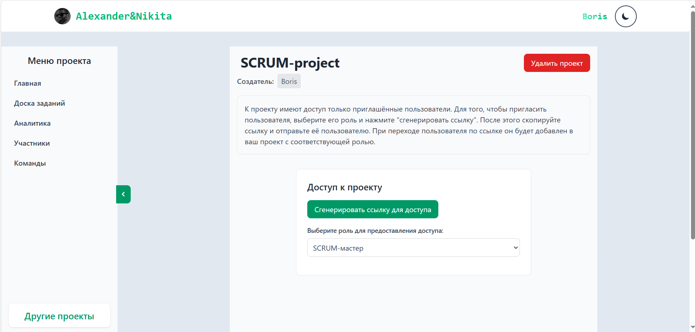
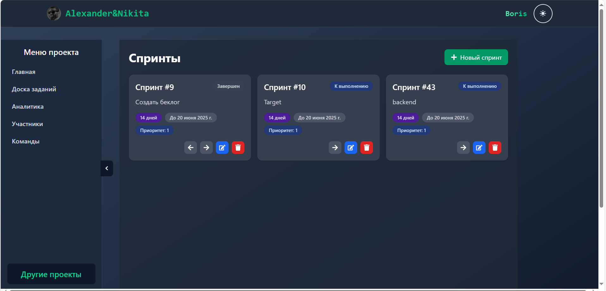
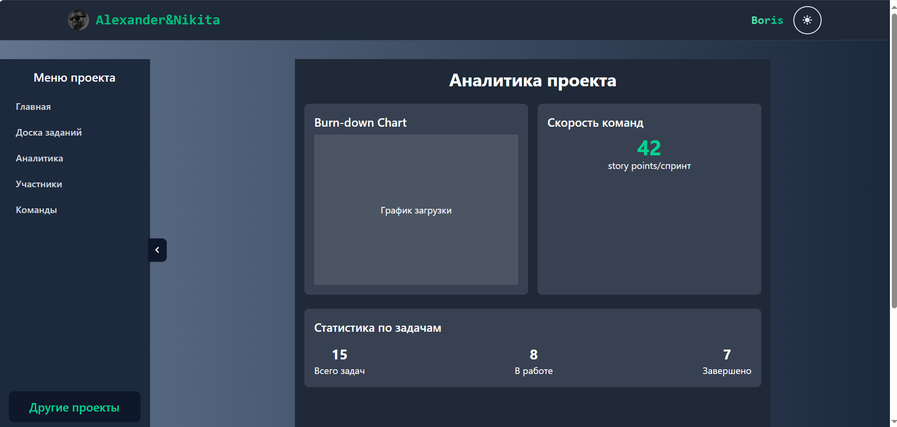

# Приложение для управления проектами с помощью SRUM

Чтобы запустить:

- открыть папку client в терминале
- npm i
- npm run dev
- кликнуть на ссылку (порт будет указан)
- открыть папку api в терминале
- запустить сборку docker-compose (нужен docker):  docker-compose up --build -d
- после сборки веб-приложение должно работать исправно

Скрины некоторых страниц приложения: 

